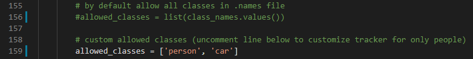

# yolov4-deepsort
[](LICENSE)

Object tracking implemented with YOLOv4, DeepSort, and TensorFlow. YOLOv4 is a state of the art algorithm that uses deep convolutional neural networks to perform object detections. We can take the output of YOLOv4 feed these object detections into Deep SORT (Simple Online and Realtime Tracking with a Deep Association Metric) in order to create a highly accurate object tracker.

## Demo of Object Tracker on Persons
<p align="center"></p>

## Demo of Object Tracker on Cars
<p align="center"></p>

## Getting Started
To get started, install the proper dependencies either via Anaconda or Pip. I recommend Anaconda route for people using a GPU as it configures CUDA toolkit version for you.

### Conda (Recommended)

```bash
# Tensorflow CPU
conda env create -f conda-cpu.yml
conda activate yolov4-cpu

# Tensorflow GPU
conda env create -f conda-gpu.yml
conda activate yolov4-gpu
```

### Pip
(TensorFlow 2 packages require a pip version >19.0.)
```bash
# TensorFlow CPU
pip install -r requirements.txt

# TensorFlow GPU
pip install -r requirements-gpu.txt
```
### Nvidia Driver (For GPU, if you are not using Conda Environment and haven't set up CUDA yet)
Make sure to use CUDA Toolkit version 10.1 as it is the proper version for the TensorFlow version used in this repository.
https://developer.nvidia.com/cuda-10.1-download-archive-update2

## Downloading Official YOLOv4 Pre-trained Weights
Our object tracker uses YOLOv4 to make the object detections, which deep sort then uses to track. There exists an official pre-trained YOLOv4 object detector model that is able to detect 80 classes. For easy demo purposes we will use the pre-trained weights for our tracker.
Download pre-trained yolov4.weights file: https://drive.google.com/open?id=1cewMfusmPjYWbrnuJRuKhPMwRe_b9PaT

Copy and paste yolov4.weights from your downloads folder into the 'data' folder of this repository.

If you want to use yolov4-tiny.weights, a smaller model that is faster at running detections but less accurate, download file here: https://github.com/AlexeyAB/darknet/releases/download/darknet_yolo_v4_pre/yolov4-tiny.weights

## Running the Tracker with YOLOv4
To implement the object tracking using YOLOv4, first we convert the .weights into the corresponding TensorFlow model which will be saved to a checkpoints folder. Then all we need to do is run the object_tracker.py script to run our object tracker with YOLOv4, DeepSort and TensorFlow.
```bash
# Convert darknet weights to tensorflow model
python save_model.py --model yolov4 

# Run yolov4 deep sort object tracker on video
python object_tracker.py --video ./data/video/test.mp4 --output ./outputs/demo.avi --model yolov4

# Run yolov4 deep sort object tracker on webcam (set video flag to 0)
python object_tracker.py --video 0 --output ./outputs/webcam.avi --model yolov4
```
The output flag allows you to save the resulting video of the object tracker running so that you can view it again later. Video will be saved to the path that you set. (outputs folder is where it will be if you run the above command!)

If you want to run yolov3 set the model flag to ``--model yolov3``, upload the yolov3.weights to the 'data' folder and adjust the weights flag in above commands. (see all the available command line flags and descriptions of them in a below section)

## Running the Tracker with YOLOv4-Tiny
The following commands will allow you to run yolov4-tiny model. Yolov4-tiny allows you to obtain a higher speed (FPS) for the tracker at a slight cost to accuracy. Make sure that you have downloaded the tiny weights file and added it to the 'data' folder in order for commands to work!
```
# save yolov4-tiny model
python save_model.py --weights ./data/yolov4-tiny.weights --output ./checkpoints/yolov4-tiny-416 --model yolov4 --tiny

# Run yolov4-tiny object tracker
python object_tracker.py --weights ./checkpoints/yolov4-tiny-416 --model yolov4 --video ./data/video/test.mp4 --output ./outputs/tiny.avi --tiny
```

## Resulting Video
As mentioned above, the resulting video will save to wherever you set the ``--output`` command line flag path to. I always set it to save to the 'outputs' folder. You can also change the type of video saved by adjusting the ``--output_format`` flag, by default it is set to AVI codec which is XVID.

Example video showing tracking of all coco dataset classes:
<p align="center"></p>

## Filter Classes that are Tracked by Object Tracker
By default the code is setup to track all 80 or so classes from the coco dataset, which is what the pre-trained YOLOv4 model is trained on. However, you can easily adjust a few lines of code in order to track any 1 or combination of the 80 classes. It is super easy to filter only the ``person`` class or only the ``car`` class which are most common.

To filter a custom selection of classes all you need to do is comment out line 159 and uncomment out line 162 of [object_tracker.py](https://github.com/theAIGuysCode/yolov4-deepsort/blob/master/object_tracker.py) Within the list ``allowed_classes`` just add whichever classes you want the tracker to track. The classes can be any of the 80 that the model is trained on, see which classes you can track in the file [data/classes/coco.names](https://github.com/theAIGuysCode/yolov4-deepsort/blob/master/data/classes/coco.names)

This example would allow the classes for person and car to be tracked.
<p align="center"></p>

### Demo of Object Tracker set to only track the class 'person'
<p align="center"></p>

### Demo of Object Tracker set to only track the class 'car'
<p align="center"></p>

## Command Line Args Reference

```bash
save_model.py:
  --weights: path to weights file
    (default: './data/yolov4.weights')
  --output: path to output
    (default: './checkpoints/yolov4-416')
  --[no]tiny: yolov4 or yolov4-tiny
    (default: 'False')
  --input_size: define input size of export model
    (default: 416)
  --framework: what framework to use (tf, trt, tflite)
    (default: tf)
  --model: yolov3 or yolov4
    (default: yolov4)
    
 object_tracker.py:
  --video: path to input video (use 0 for webcam)
    (default: './data/video/test.mp4')
  --output: path to output video (remember to set right codec for given format. e.g. XVID for .avi)
    (default: None)
  --output_format: codec used in VideoWriter when saving video to file
    (default: 'XVID)
  --[no]tiny: yolov4 or yolov4-tiny
    (default: 'false')
  --weights: path to weights file
    (default: './checkpoints/yolov4-416')
  --framework: what framework to use (tf, trt, tflite)
    (default: tf)
  --model: yolov3 or yolov4
    (default: yolov4)
  --size: resize images to
    (default: 416)
  --iou: iou threshold
    (default: 0.45)
  --score: confidence threshold
    (default: 0.50)
  --dont_show: dont show video output
    (default: False)
  --info: print detailed info about tracked objects
    (default: False)
```

### References  

   Huge shoutout goes to hunglc007 and nwojke for creating the backbones of this repository:
  * [tensorflow-yolov4-tflite](https://github.com/hunglc007/tensorflow-yolov4-tflite)
  * [Deep SORT Repository](https://github.com/nwojke/deep_sort)
